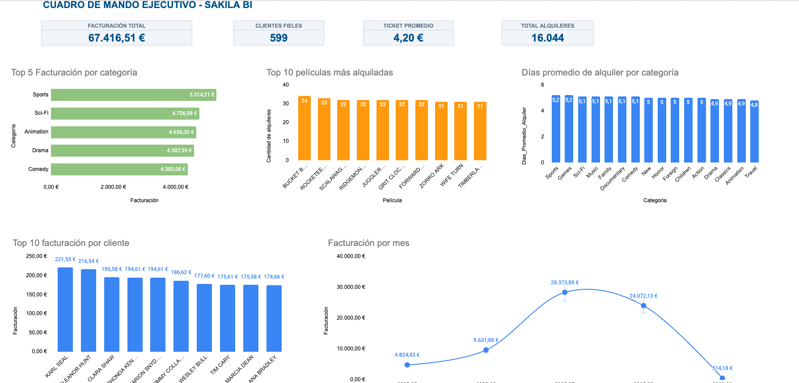

# Análisis de la base de datos Sakila — SQL + Dashboard

Análisis de negocio sobre la base de datos Sakila (alquiler de películas), resolviendo preguntas de negocio reales mediante SQL y construyendo un dashboard ejecutivo en Google Sheets.

🔗 **Dashboard:** [Google Sheets](https://docs.google.com/spreadsheets/d/1fhx2m5w2Ie1kjdXPon4QcrPVehPwSF55HTyJdh7a0xI/edit)

## Dashboard



> Nota: el último mes de la serie temporal (2006-02) corresponde a un periodo parcial dentro del dataset original de Sakila, lo que explica la caída brusca de facturación frente al resto de meses.

## Resumen ejecutivo

| Facturación total | Clientes fieles | Ticket promedio | Total alquileres |
|---|---|---|---|
| 67.416,51 € | 599 | 4,20 € | 16.044 |

## Preguntas de negocio y consultas SQL

### 1. ¿Cuánto recaudamos por mes?
```sql
SELECT
    strftime('%Y-%m', payment_date) AS Año_Mes,
    SUM(amount) AS Facturación
FROM payment
GROUP BY Año_Mes
ORDER BY Año_Mes ASC;
```
**Insight:** se detectó una caída drástica de ingresos en 2006-02 frente a los meses previos, sin embargo debe interpretarse con cautela, ya que corresponde a un periodo parcial dentro del dataset. Este caso ilustra la importancia de validar la completitud de los datos antes de extraer conclusiones de negocio.

### 2. ¿Cuáles son las 5 categorías de películas que más ingresos generan?
```sql
SELECT
    c.category_id AS Id,
    c.name AS Categoria,
    SUM(amount) AS Facturacion
FROM category c
JOIN film_category fc ON c.category_id = fc.category_id
JOIN inventory i ON fc.film_id = i.film_id
JOIN rental r ON r.inventory_id = i.inventory_id
JOIN payment p ON p.rental_id = r.rental_id
GROUP BY c.category_id, c.name
ORDER BY Facturacion DESC
LIMIT 5;
```
**Insight:** Sports, Sci-Fi y Animation lideran la facturación por categoría.

### 3. ¿Qué 10 películas tuvieron más alquileres?
```sql
SELECT
    f.film_id AS ID,
    f.title AS Película,
    COUNT(r.rental_id) AS Cantidad_de_Alquileres
FROM rental r
JOIN inventory i ON r.inventory_id = i.inventory_id
JOIN film f ON f.film_id = i.film_id
GROUP BY Película
ORDER BY Cantidad_de_Alquileres DESC
LIMIT 10;
```
**Insight:** la diferencia entre la película más alquilada (34 alquileres) y la 10ª (31) es mínima, por lo que no hay un "blockbuster" que destaque de forma aislada, sino un grupo amplio de títulos con demanda similar. Esto sugiere que el catálogo está bien diversificado más que dependiente de pocos títulos estrella.

### 4. ¿Quiénes son nuestros 10 mejores clientes (Top VIP)?
```sql
SELECT
    c.customer_id,
    CONCAT(c.first_name, ' ', c.last_name) AS Nombre_cliente,
    SUM(p.amount) AS Facturación
FROM customer c
JOIN payment p ON c.customer_id = p.customer_id
GROUP BY Nombre_cliente
ORDER BY Facturación DESC
LIMIT 10;
```
**Insight:** el cliente top (Karl Seal, 221,55 €) factura un 27% más que el décimo (Ana Bradley, 174,66 €), una diferencia moderada pero que indica que el negocio no depende de 2-3 clientes críticos, sino de una base de clientes fieles con gasto relativamente homogéneo.

### 5. Top 3 películas por facturación en Acción vs. Comedia
```sql
WITH RANKED_CATEGORIES AS (
    SELECT
        c.name AS Categoría,
        f.title AS Película,
        SUM(p.amount) AS Facturación,
        ROW_NUMBER() OVER (PARTITION BY c.name ORDER BY SUM(p.amount) DESC) AS RANKING
    FROM category c
    JOIN film_category fc ON fc.category_id = c.category_id
    JOIN film f ON f.film_id = fc.film_id
    JOIN inventory i ON i.film_id = fc.film_id
    JOIN rental r ON r.inventory_id = i.inventory_id
    JOIN payment p ON p.rental_id = r.rental_id
    GROUP BY Categoría, Película
)
SELECT Categoría, Película, Facturación, RANKING
FROM RANKED_CATEGORIES
WHERE RANKING <= 3
AND Categoría IN ('Action', 'Comedy');
```
**Insight:** mediante funciones de ventana (`ROW_NUMBER`) se obtuvo el ranking de películas más rentables dentro de las categorias Action y Comedy. Este tipo de análisis segmentado es más útil que un ranking global porque permite tomar decisiones de catálogo por categoría. Por ejemplo, reforzar las categorías que ya lideran con los títulos que más traccionan dentro de ellas.

### 6. Análisis de fidelidad — clientes que alquilaron en más de un mes
```sql
SELECT COUNT(customer_id) AS Clientes_Fieles
FROM (
    SELECT customer_id
    FROM payment
    GROUP BY customer_id
    HAVING COUNT(DISTINCT strftime('%m', payment_date)) > 1
);
```
**Insight:** 599 clientes alquilaron en más de un mes distinto. Esto da una idea del nivel de recurrencia real del negocio, una métrica clave para decidir si invertir en retención o en captación de nuevos clientes.

### 7. Rendimiento por tienda y gerente
```sql
SELECT
    s.store_id AS Tienda,
    CONCAT(staff.first_name, ' ', staff.last_name) AS Gerente,
    COUNT(DISTINCT r.rental_id) AS Total_Alquileres,
    SUM(p.amount) AS Facturacion_Total,
    ROUND(SUM(p.amount) / COUNT(DISTINCT r.rental_id), 2) AS Ticket_promedio
FROM store s
JOIN staff ON s.manager_staff_id = staff.staff_id
JOIN inventory i ON i.store_id = s.store_id
JOIN rental r ON r.inventory_id = i.inventory_id
JOIN payment p ON p.rental_id = r.rental_id
GROUP BY s.store_id;
```
**Insight:** La tienda 1 (Mike Hillyer) y la tienda 2 (Jon Stephens) presentan una facturación total casi idéntica (33.679 € vs 33.726 €) pese a tener volúmenes de alquiler distintos (7.923 vs 8.121). Esto implica una diferencia en ticket promedio de cada tienda aunque pequeña (4,25 € vs 4,15 €), lo que indica un rendimiento muy equilibrado entre ambas.

### 8. Duración promedio de alquiler por categoría
```sql
SELECT
    c.name AS Categoria,
    ROUND(AVG(julianday(r.return_date) - julianday(r.rental_date)), 1) AS Dias_Promedio_Alquiler
FROM category c
JOIN film_category fc ON fc.category_id = c.category_id
JOIN film f ON f.film_id = fc.film_id
JOIN inventory i ON i.film_id = f.film_id
JOIN rental r ON r.inventory_id = i.inventory_id
GROUP BY c.name
ORDER BY Dias_Promedio_Alquiler DESC;
```
**Insight:** la diferencia entre categorías es pequeña (entre 4,8 y 5,2 días de media), lo que sugiere que la política de duración de alquiler está bien estandarizada y no hay una categoría que esté generando fricción operativa por retrasos en devolución.

## Conclusiones y recomendaciones

Si este análisis se presentara a un gerente del negocio, las acciones priorizadas serían:

1. **La serie temporal presenta meses ausentes (septiembre 2005 – enero 2006) y un último mes incompleto (febrero 2006)**. Antes de usar estos datos para previsiones o decisiones estacionales, sería imprescindible determinar si esos meses no existen en el negocio real o si son un problema de completitud del dataset, ya que una serie impcompleta puede llevar a conclusiones erróneas sobre estacionalidad o tendencias.
2. **Reforzar el catálogo en las categorías top (Sports, Sci-Fi, Animation)** con nuevas adquisiciones o promociones cruzadas, ya que concentran la mayor facturación pero no muestran una dependencia excesiva de pocos títulos. Es decir, hay margen para escalar sin riesgo de saturar la demanda.
3. **Diseñar un programa de fidelización para los 599 clientes recurrentes**, dado que son la base estable del negocio; un pequeño incremento en su frecuencia de alquiler tendría más impacto que captar clientes nuevos de forma agresiva.
4. **Replicar las prácticas de la tienda con mejor ticket promedio en la de menor rendimiento**, ya que la diferencia parece estar más relacionada con gestión comercial que con volumen de inventario.
5. **Mantener la política actual de duración de alquiler**, dado que no se detectan categorías problemáticas — los recursos de mejora deberían enfocarse en facturación y fidelización, no en esta variable.

## Herramientas utilizadas
- **SQL** (SQLite) — extracción y transformación de datos
- **DB Browser for SQLite** — ejecución y prueba de consultas
- **Google Sheets** — dashboard ejecutivo y visualizaciones
- **IA(Claude)** - apoyo en documentación y revisión de consultas

## Autor
Alberto Díaz González — [LinkedIn](https://linkedin.com/in/alberto-díaz-gonzález-0082a1275)
