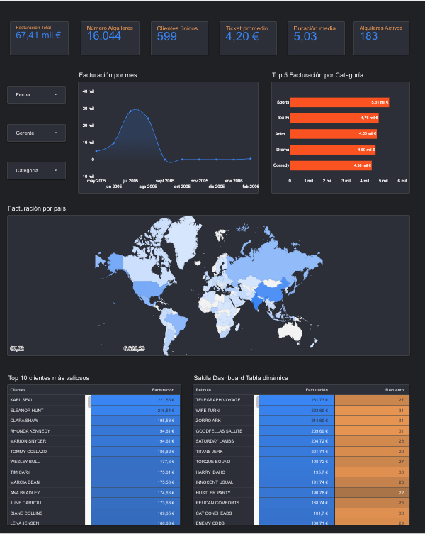

# Proyecto Análsis de datos Sakila BI: Solución End-to-End con SQL, Google Sheets y Looker Studio
 
Análisis de negocio sobre la base de datos Sakila (alquiler de películas), resolviendo preguntas de negocio reales mediante SQL y construyendo un ecosistema de Dashboards ejecutivos para la toma de decisiones.

## 📈 Enlaces a los Entornos de Business Intelligence

El proyecto ha evolucionado en dos soluciones analíticas interactivas:

* 📊 **Versión 2 (Recomendada):** [🔗 Dashboard Interactivo en Looker Studio](https://datastudio.google.com/reporting/2e5b8a6d-262e-4262-8889-9ff296432986)
* 🗃️ **Dataset v2:** [🔗 Tabla Desnormalizada y Limpia en Google Sheets](https://docs.google.com/spreadsheets/d/1_HzqaoR0-CMprCLeIgRm3JKXNrsRdPcbMC31Ff9K4gs/edit?usp=sharing)
* 📑 **Versión 1 (Inicial):** [Reporte Estático en Google Sheets](https://docs.google.com/spreadsheets/d/1fhx2m5w2Ie1kjdXPon4QcrPVehPwSF55HTyJdh7a0xI/edit)

## Dashboards Ejecutivos

### 🔹 Versión 2: Centro de Control Dinámico (Looker Studio)

### 🔹 Versión 1: Reporte Tabular (Google Sheets)


> Nota: el último mes de la serie temporal (2006-02) corresponde a un periodo parcial dentro del dataset original de Sakila, lo que explica la caída brusca de facturación frente al resto de meses.

## Resumen ejecutivo (métricas Validadas v2)
| Facturación total (Neto) | Clientes Únicos | Ticket promedio | Total alquileres | Duración Media | Alquileres Activos |
| :---: | :---: | :---: | :---: | :---: | :---: |
| **67.406,56 €** | **599** | **4,20 €** | **16.044** | **5,03 Días** | **183** |

---
## 🔍 Control de Calidad de Datos & Auditoría (QA)

Antes de conectar los datos al entorno visual de la Versión 2, se realizó una auditoría profunda del dataset original de Sakila, detectando dos anomalías críticas que fueron resueltas para proteger la integridad del análisis:

### 🪙 1. Conciliación Financiera (Discrepancia de 9,95 €)
Al auditar la facturación bruta total de la tabla `payment`, aparecía un desfase no idnetificado en la versión 1 de **9,95 €** que no cruzaba con los registros de alquiler. Mediante rastreo SQL se descubrió que correspondía exactamente a **5 pagos huérfanos que carecían de un `rental_id` asociado**. 
* **Acción correctiva:** Se aplicó un `INNER JOIN` estricto en el modelo analítico para procesar únicamente ingresos vinculados a alquileres reales y verificados, aislando los 9,95 € como una incidencia del sistema transaccional de origen.

### ⏳ 2. Descubrimiento del Efecto de Corte de Datos 
Al analizar los días de duración de los alquileres, saltaron las alarmas por **183 registros con la fecha de devolución en blanco (nulos)**. 
* **El Insight:** Al realizar un análisis de frecuencia temporal, se descubrió que **182 de esos casos ocurrieron de forma síncrona el 14/02/2006** (la última fecha registrada en el histórico). Esto demostró de forma matemática que no se trataba de pérdidas de stock o robos, sino de un efecto de corte de datos: el dataset finaliza abruptamente mientras el videoclub operaba, dejando esos 183 alquileres marcados correctamente como **"Alquileres Activos"** en manos de los clientes.

---

## 🛠️ Query SQl de Desnormalización (Versión 2)
Para poder alimentar los filtros cruzados en tiempo real de Looker Studio (Tiendas, Gerentes, Categorías y Países), se diseñó esta consulta avanzada que unifica el modelo relacional en una única tabla analítica, controlando los nulos y aplicando los filtros de auditoría financiera definidos en el proceso de QA:
```sql
SELECT 
    p.payment_id AS ID_Pago,
    strftime('%Y-%m-%d', p.payment_date) AS Fecha_Completa,
    strftime('%Y-%m', p.payment_date) AS Año_Mes,
    p.amount AS Importe,
    r.rental_id AS ID_Alquiler,
    c.customer_id AS ID_Cliente,
    (c.first_name || ' ' || c.last_name) AS Nombre_Cliente,
	ci.city as Ciudad_Cliente,
	co.country as País_Cliente,
    s.store_id AS ID_Tienda,
    (staff.first_name || ' ' || staff.last_name) AS Nombre_Gerente,
    f.title AS Titulo_Pelicula,
    cat.name AS Categoria_Pelicula,
   round( julianday(r.return_date) - julianday(r.rental_date),2) AS Dias_Duracion_Alquiler
FROM payment p
JOIN rental r ON p.rental_id = r.rental_id
JOIN customer c ON p.customer_id = c.customer_id
JOIN staff staff ON p.staff_id = staff.staff_id
JOIN store s ON staff.store_id = s.store_id
JOIN inventory i ON r.inventory_id = i.inventory_id
JOIN film f ON i.film_id = f.film_id
JOIN film_category fc ON f.film_id = fc.film_id
JOIN category cat ON fc.category_id = cat.category_id
JOIN address ad ON c.address_id = ad.address_id 
JOIN city ci ON ad.city_id = ci.city_id
JOIN country co ON ci.country_id = co.country_id
ORDER BY ID_Pago
```

## Preguntas de negocio y consultas SQL (Versión 1)

### 1. ¿Cuánto recaudamos por mes?
```sql
SELECT
    strftime('%Y-%m', payment_date) AS Año_Mes,
    SUM(amount) AS Facturación
FROM payment
GROUP BY Año_Mes
ORDER BY Año_Mes ASC;
```
**Insight:** se detectó una caída drástica de ingresos en 2006-02 frente a los meses previos, sin embargo debe interpretarse con cautela, ya que corresponde a un periodo parcial dentro del dataset. Este caso ilustra la importancia de validar la completitud de los datos antes de extraer conclusiones de negocio.

### 2. ¿Cuáles son las 5 categorías de películas que más ingresos generan?
```sql
SELECT
    c.category_id AS Id,
    c.name AS Categoria,
    SUM(amount) AS Facturacion
FROM category c
JOIN film_category fc ON c.category_id = fc.category_id
JOIN inventory i ON fc.film_id = i.film_id
JOIN rental r ON r.inventory_id = i.inventory_id
JOIN payment p ON p.rental_id = r.rental_id
GROUP BY c.category_id, c.name
ORDER BY Facturacion DESC
LIMIT 5;
```
**Insight:** Sports, Sci-Fi y Animation lideran la facturación por categoría.

### 3. ¿Qué 10 películas tuvieron más alquileres?
```sql
SELECT
    f.film_id AS ID,
    f.title AS Película,
    COUNT(r.rental_id) AS Cantidad_de_Alquileres
FROM rental r
JOIN inventory i ON r.inventory_id = i.inventory_id
JOIN film f ON f.film_id = i.film_id
GROUP BY Película
ORDER BY Cantidad_de_Alquileres DESC
LIMIT 10;
```
**Insight:** la diferencia entre la película más alquilada (34 alquileres) y la 10ª (31) es mínima, por lo que no hay un "blockbuster" que destaque de forma aislada, sino un grupo amplio de títulos con demanda similar. Esto sugiere que el catálogo está bien diversificado más que dependiente de pocos títulos estrella.

### 4. ¿Quiénes son nuestros 10 mejores clientes (Top VIP)?
```sql
SELECT
    c.customer_id,
    CONCAT(c.first_name, ' ', c.last_name) AS Nombre_cliente,
    SUM(p.amount) AS Facturación
FROM customer c
JOIN payment p ON c.customer_id = p.customer_id
GROUP BY Nombre_cliente
ORDER BY Facturación DESC
LIMIT 10;
```
**Insight:** el cliente top (Karl Seal, 221,55 €) factura un 27% más que el décimo (Ana Bradley, 174,66 €), una diferencia moderada pero que indica que el negocio no depende de 2-3 clientes críticos, sino de una base de clientes fieles con gasto relativamente homogéneo.

### 5. Top 3 películas por facturación en Acción vs. Comedia
```sql
WITH RANKED_CATEGORIES AS (
    SELECT
        c.name AS Categoría,
        f.title AS Película,
        SUM(p.amount) AS Facturación,
        ROW_NUMBER() OVER (PARTITION BY c.name ORDER BY SUM(p.amount) DESC) AS RANKING
    FROM category c
    JOIN film_category fc ON fc.category_id = c.category_id
    JOIN film f ON f.film_id = fc.film_id
    JOIN inventory i ON i.film_id = fc.film_id
    JOIN rental r ON r.inventory_id = i.inventory_id
    JOIN payment p ON p.rental_id = r.rental_id
    GROUP BY Categoría, Película
)
SELECT Categoría, Película, Facturación, RANKING
FROM RANKED_CATEGORIES
WHERE RANKING <= 3
AND Categoría IN ('Action', 'Comedy');
```
**Insight:** mediante funciones de ventana (`ROW_NUMBER`) se obtuvo el ranking de películas más rentables dentro de las categorias Action y Comedy. Este tipo de análisis segmentado es más útil que un ranking global porque permite tomar decisiones de catálogo por categoría. Por ejemplo, reforzar las categorías que ya lideran con los títulos que más traccionan dentro de ellas.

### 6. Análisis de fidelidad — clientes que alquilaron en más de un mes
```sql
SELECT COUNT(customer_id) AS Clientes_Fieles
FROM (
    SELECT customer_id
    FROM payment
    GROUP BY customer_id
    HAVING COUNT(DISTINCT strftime('%m', payment_date)) > 1
);
```
**Insight:** 599 clientes alquilaron en más de un mes distinto. Esto da una idea del nivel de recurrencia real del negocio, una métrica clave para decidir si invertir en retención o en captación de nuevos clientes.

### 7. Rendimiento por tienda y gerente
```sql
SELECT
    s.store_id AS Tienda,
    CONCAT(staff.first_name, ' ', staff.last_name) AS Gerente,
    COUNT(DISTINCT r.rental_id) AS Total_Alquileres,
    SUM(p.amount) AS Facturacion_Total,
    ROUND(SUM(p.amount) / COUNT(DISTINCT r.rental_id), 2) AS Ticket_promedio
FROM store s
JOIN staff ON s.manager_staff_id = staff.staff_id
JOIN inventory i ON i.store_id = s.store_id
JOIN rental r ON r.inventory_id = i.inventory_id
JOIN payment p ON p.rental_id = r.rental_id
GROUP BY s.store_id;
```
**Insight:** La tienda 1 (Mike Hillyer) y la tienda 2 (Jon Stephens) presentan una facturación total casi idéntica (33.679 € vs 33.726 €) pese a tener volúmenes de alquiler distintos (7.923 vs 8.121). Esto implica una diferencia en ticket promedio de cada tienda aunque pequeña (4,25 € vs 4,15 €), lo que indica un rendimiento muy equilibrado entre ambas.

### 8. Duración promedio de alquiler por categoría
```sql
SELECT
    c.name AS Categoria,
    ROUND(AVG(julianday(r.return_date) - julianday(r.rental_date)), 1) AS Dias_Promedio_Alquiler
FROM category c
JOIN film_category fc ON fc.category_id = c.category_id
JOIN film f ON f.film_id = fc.film_id
JOIN inventory i ON i.film_id = f.film_id
JOIN rental r ON r.inventory_id = i.inventory_id
GROUP BY c.name
ORDER BY Dias_Promedio_Alquiler DESC;
```
**Insight:** la diferencia entre categorías es pequeña (entre 4,8 y 5,2 días de media), lo que sugiere que la política de duración de alquiler está bien estandarizada y no hay una categoría que esté generando fricción operativa por retrasos en devolución.

## Conclusiones y recomendaciones

Si este análisis se presentara a un gerente del negocio, las acciones priorizadas serían:

1. **Gobernanza de Datos ante la Brecha Temporal:** La serie histórica presenta una ausencia total de registros entre septiembre de 2005 y enero de 2006, además de un cierre truncado en febrero de 2006. El hallazgo analítico del efecto corte de datos (los 183 alquileres activos sin devolver) confirma un corte abrupto en la recolección de datos y no un cese de actividad comercial. Se recomienda auditar los sistemas transaccionales de origen antes de utilizar estos datos para modelos predictivos de demanda o estacionalidad.
2. **Diversificación de Catálogo en Categorías Líderes:** Las categorías *Sports*, *Sci-Fi* y *Animation* concentran la mayor facturación global. Dado que el análisis revela que no existe una dependencia crítica de pocos títulos estrella (blockbusters), se concluye que la demanda está saludablemente distribuida. Existe un margen óptimo para escalar el inventario en estas categorías sin riesgo de saturación.
3. **Optimización del LTV (Lifetime Value) mediante Fidelización:** La base estable y crítica del negocio está soportada por una cartera de **599 clientes únicos recurrentes**. Estratégicamente, resulta mucho más rentable diseñar un programa de fidelización que incremente marginalmente su frecuencia de alquiler actual que ejecutar campañas agresivas y costosas de adquisición de nuevos clientes.
4. **Estandarización de Prácticas Comerciales por Sucursal:** A pesar de que ambas tiendas igualan su facturación total, la sucursal de **Mike Hillyer** logra un ticket promedio superior (4,25 €) frente a la de Jon Stephens (4,15 €) con un menor volumen físico de transacciones. Se recomienda replicar las estrategias de venta cruzada y el mix de exhibición de categorías de la Tienda 1 para maximizar el rendimiento de la Tienda 2.
5. **Validación Operativa de los Tiempos de Retención:** Tras aislar rigurosamente las anomalías y registros nulos en el proceso de QA, se demostró que el tiempo medio real de retención de stock se sitúa de manera consistente en **5,03 días de promedio**. Al no detectarse desviaciones ni fricciones críticas entre categorías, se aconseja mantener la política de devoluciones actual y redirigir los esfuerzos hacia la optimización de precios y fidelización.

## Herramientas utilizadas
- **SQL** (SQLite) — extracción y transformación de datos
- **DB Browser for SQLite** — ejecución y prueba de consultas
- **Google Sheets** — dashboard ejecutivo y visualizaciones
- **Google Data/Looker Studio** - dasboard profesional automatizado interactivo con filtros y segmentadores
- **IA(Claude)** - apoyo en documentación y revisión de consultas

## Autor
Alberto Díaz González — [LinkedIn](https://linkedin.com/in/alberto-díaz-gonzález-0082a1275)
